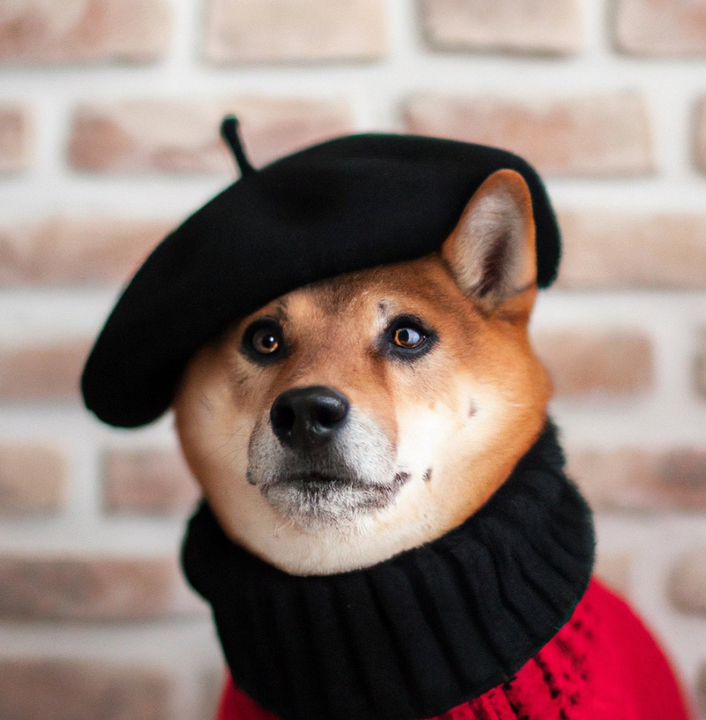
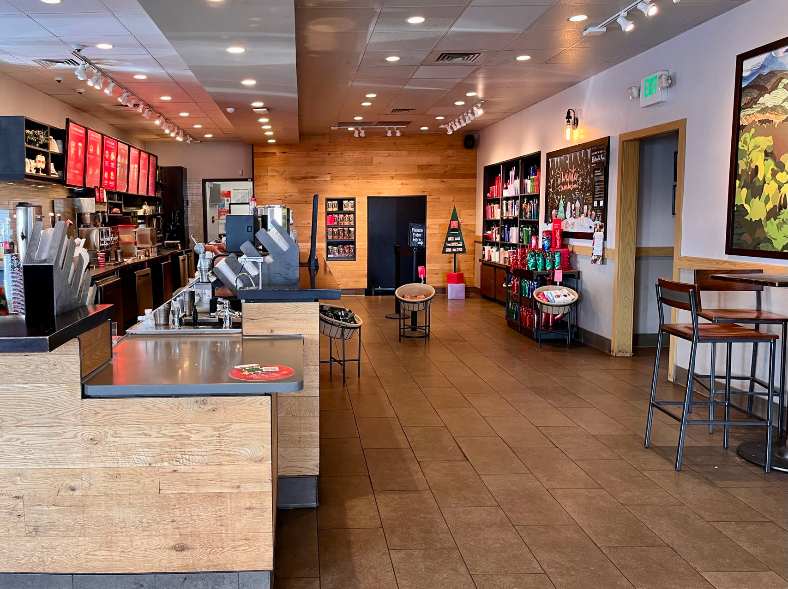

# Object Recognition as Next Token Prediction

[arXiv](https://arxiv.org/abs/2312.02142) | [Colab](https://colab.research.google.com/drive/1pJX37LP5xGLDzD3H7ztTmpq1RrIBeWX3?usp=sharing) | [Documentation](docs/README.md)

## Introduction

This project delves into a fundamental problem in computer vision − object recognition − translating an image into object labels.

<p align="center">
  <br/>
  
  
  <br/>
</p>

Linear models (such as ResNet) and contrastive models (such as CLIP) require predefined labels **before** inference, limiting their flexibility in real-world applications.

We extend **W** to cover the entire textual space using language models like LLaMA's 32K token embeddings.
Our model predicts labels in a real-open manner through auto-regressive processing.

Additionally, our one-shot sampling technique enables efficient large-scale discriminative predictions, such as the top-100 labels.


## Examples 

| Image | Top-20 Predictions |
|-------|-------------|
| <p align="center"></p> | <details><summary>click to review</summary>`prob: 0.30731 - dog`<br/>`prob: 0.13647 - sweater`<br/>`prob: 0.11870 - hat`<br/>`prob: 0.06812 - scarf`<br/>`prob: 0.04131 - brick`<br/>`prob: 0.03114 - wall`<br/>`prob: 0.01796 - shirt`<br/>`prob: 0.01471 - cute`<br/>`prob: 0.01156 - cap`<br/>`prob: 0.00982 - neck`<br/>`prob: 0.00929 - top`<br/>`prob: 0.00797 - head`<br/>`prob: 0.00777 - beanie`<br/>`prob: 0.00658 - man`<br/>`prob: 0.00588 - sits`<br/>`prob: 0.00582 - coat`<br/>`prob: 0.00524 - jacket`<br/>`prob: 0.00476 - collar`<br/>`prob: 0.00460 - face`<br/>`prob: 0.00119 - bone`</details> |
| <p align="center"></p> | <details><summary>click to review</summary>`prob: 0.14861 - coffee`<br/>`prob: 0.10409 - shop`<br/>`prob: 0.08065 - counter`<br/>`prob: 0.04603 - bar`<br/>`prob: 0.04055 - restaurant`<br/>`prob: 0.03691 - inside`<br/>`prob: 0.03468 - area`<br/>`prob: 0.02638 - store`<br/>`prob: 0.02219 - table`<br/>`prob: 0.01930 - interior`<br/>`prob: 0.01347 - lot`<br/>`prob: 0.01156 - food`<br/>`prob: 0.01058 - customer`<br/>`prob: 0.01001 - room`<br/>`prob: 0.00923 - starbucks`<br/>`prob: 0.00853 - bakery`<br/>`prob: 0.00738 - view`<br/>`prob: 0.00738 - floor`<br/>`prob: 0.00733 - cafe`<br/>`prob: 0.00633 - shelf`</details> |
| <p align="center"></p> | <details><summary>click to review</summary>`prob: 0.47652 - monster`<br/>`prob: 0.09664 - cartoon`<br/>`prob: 0.03812 - character`<br/>`prob: 0.03724 - group`<br/>`prob: 0.03312 - creature`<br/>`prob: 0.02111 - cute`<br/>`prob: 0.01929 - vector`<br/>`prob: 0.01481 - animal`<br/>`prob: 0.00955 - art`<br/>`prob: 0.00924 - alien`<br/>`prob: 0.00837 - pose`<br/>`prob: 0.00604 - bubble`<br/>`prob: 0.00553 - eye`<br/>`prob: 0.00533 - color`<br/>`prob: 0.00528 - hand`<br/>`prob: 0.00477 - design`<br/>`prob: 0.00474 - wallpaper`<br/>`prob: 0.00462 - child`<br/>`prob: 0.00445 - people`<br/>`prob: 0.00445 - family`</details> |
| <p align="center"></p> | <details><summary>click to review</summary>`prob: 0.54285 - cloud`<br/>`prob: 0.09991 - word`<br/>`prob: 0.07559 - sky`<br/>`prob: 0.03172 - letter`<br/>`prob: 0.01875 - sora`<br/>`prob: 0.01388 - logo`<br/>`prob: 0.01001 - text`<br/>`prob: 0.00719 - top`<br/>`prob: 0.00719 - blue`<br/>`prob: 0.00676 - title`<br/>`prob: 0.00611 - photo`<br/>`prob: 0.00427 - picture`<br/>`prob: 0.00288 - sonora`<br/>`prob: 0.00271 - middle`<br/>`prob: 0.00254 - storm`<br/>`prob: 0.00191 - sun`<br/>`prob: 0.00188 - art`<br/>`prob: 0.00155 - soar`<br/>`prob: 0.00041 - icy`</details> |
| <p align="center"></p> | <details><summary>click to review</summary>`prob: 0.15317 - building`<br/>`prob: 0.13619 - wave`<br/>`prob: 0.04782 - room`<br/>`prob: 0.03498 - middle`<br/>`prob: 0.03188 - hall`<br/>`prob: 0.02367 - people`<br/>`prob: 0.02135 - ocean`<br/>`prob: 0.02087 - floor`<br/>`prob: 0.01867 - world`<br/>`prob: 0.01773 - inside`<br/>`prob: 0.01548 - man`<br/>`prob: 0.01380 - water`<br/>`prob: 0.01205 - view`<br/>`prob: 0.01200 - surfer`<br/>`prob: 0.01109 - photo`<br/>`prob: 0.00798 - hotel`<br/>`prob: 0.00734 - city`<br/>`prob: 0.00662 - pool`<br/>`prob: 0.00566 - art`<br/>`prob: 0.00319 - mural`</details> |
| <p align="center"></p> | <details><summary>click to review</summary>`prob: 0.07247 - tablet`<br/>`prob: 0.06770 - coffee`<br/>`prob: 0.06562 - window`<br/>`prob: 0.05829 - controller`<br/>`prob: 0.05668 - game`<br/>`prob: 0.04802 - switch`<br/>`prob: 0.04043 - wii`<br/>`prob: 0.03798 - console`<br/>`prob: 0.03563 - cup`<br/>`prob: 0.02570 - top`<br/>`prob: 0.02067 - mug`<br/>`prob: 0.01808 - screen`<br/>`prob: 0.01344 - video`<br/>`prob: 0.01105 - star`<br/>`prob: 0.01092 - nintendo`<br/>`prob: 0.01055 - computer`<br/>`prob: 0.00819 - mario`<br/>`prob: 0.00815 - remote`<br/>`prob: 0.00736 - control`<br/>`prob: 0.00393 - sill`</details> |
| <p align="center"></p> | <details><summary>click to review</summary>`prob: 0.36523 - airplane`<br>`prob: 0.09151 - cargo`<br>`prob: 0.07531 - plane`<br>`prob: 0.05538 - ship`<br>`prob: 0.04223 - container`<br>`prob: 0.03105 - water`<br>`prob: 0.03040 - view`<br>`prob: 0.02277 - dock`<br>`prob: 0.01685 - port`<br>`prob: 0.01434 - sky`<br>`prob: 0.01328 - shipping`<br>`prob: 0.00788 - middle`<br>`prob: 0.00751 - body`<br>`prob: 0.00717 - photo`<br>`prob: 0.00715 - jet`<br>`prob: 0.00714 - city`<br>`prob: 0.00621 - ocean`<br>`prob: 0.00615 - freight`<br>`prob: 0.00609 - boat`<br>`prob: 0.00320 - transportation`</details> |
| <p align="center"></p> | <details><summary>click to review</summary>`prob: 0.15236 - candy`<br/>`prob: 0.12271 - sweater`<br/>`prob: 0.11457 - glass`<br/>`prob: 0.10593 - dog`<br/>`prob: 0.08311 - chair`<br/>`prob: 0.07111 - cane`<br/>`prob: 0.04701 - sunglass`<br/>`prob: 0.04589 - christmas`<br/>`prob: 0.02361 - costume`<br/>`prob: 0.02085 - wearing`<br/>`prob: 0.01870 - hat`<br/>`prob: 0.00734 - head`<br/>`prob: 0.00636 - top`<br/>`prob: 0.00577 - outfit`<br/>`prob: 0.00520 - chocolate`<br/>`prob: 0.00437 - holi`<br/>`prob: 0.00362 - suit`<br/>`prob: 0.00344 - shirt`<br/>`prob: 0.00322 - strawberry`<br/>`prob: 0.00211 - wig`</details> |
| <p align="center"></p> | <details><summary>click to review</summary>`prob: 0.19960 - living`<br/>`prob: 0.16291 - room`<br/>`prob: 0.11353 - sofa`<br/>`prob: 0.06036 - couch`<br/>`prob: 0.04741 - rug`<br/>`prob: 0.04704 - coffee`<br/>`prob: 0.03795 - dog`<br/>`prob: 0.03659 - wall`<br/>`prob: 0.02980 - table`<br/>`prob: 0.01611 - floor`<br/>`prob: 0.01594 - grey`<br/>`prob: 0.01472 - wood`<br/>`prob: 0.01353 - furniture`<br/>`prob: 0.01314 - plant`<br/>`prob: 0.01274 - fireplace`<br/>`prob: 0.01161 - pillow`<br/>`prob: 0.00941 - chair`<br/>`prob: 0.00512 - home`<br/>`prob: 0.00434 - blanket`<br/>`prob: 0.00351 - art`</details> |

## Models

The following table shows the reproduced results of recall (**R** column in Table 1 of the paper) on the validation splits with top-10 predictions.

<table>
  <tbody>
  <th valign="bottom"># params</th>
  <th valign="bottom">training group</th>
  <th valign="bottom">checkpoint</th>
  <th valign="bottom">md5</th>
  <th valign="bottom">CC3M</th>
  <th valign="bottom">COCO</th>
  <th valign="bottom">OpenImages</th>
  <tr>
    <td align="center">1.78B</td>
    <td align="center">&nbsp;&nbsp;G3M</td>
    <td align="center"><a href="https://drive.google.com/file/d/1QYT7kXD9qks6rQh0m2PnVlnSffj8VXNh/view?usp=sharing">Google Drive</a> | <a href="https://huggingface.co/kaiyuyue/nxtp/tree/main">Hugging Face</a></td>
    <td align="center"><tt>b2a69b</tt></td>
    <td align="center">0.740</td>
    <td align="center">0.703</td>
    <td align="center">0.616</td>
  </tr> 
  <tr>
    <td align="center">1.78B</td>
    <td align="center">G70M</td>
    <td align="center">-</td>
    <td align="center">-</td>
    <td align="center">0.721</td>
    <td align="center">0.765</td>
    <td align="center">0.662</td>
  </tr>
  </tbody>
</table>

> [!NOTE]
> The model trained on G70M won't be released due to substantial privacy and safety risks associated with [LAION](https://laion.ai/blog/laion-400-open-dataset/#disclaimer--content-warning)'s large-scale, untargeted content scraping.

### Downloading

The checkpoints can be downloaded from the links in the table above.

- For downloading from Google Drive, one option is to use [gdown](https://github.com/wkentaro/gdown) instead of the web browser:

  ```bash
  # install gdown toolkit
  pip install gdown

  # download the checkpoint in terminal
  gdown --fuzzy https://drive.google.com/file/d/1QYT7kXD9qks6rQh0m2PnVlnSffj8VXNh/view
  ```

- For downloading from Hugging Face, one option is to use [git-lfs](https://huggingface.co/docs/hub/models-downloading#using-git):

  ```bash
  # install git lfs
  git lfs install

  # download the checkpoint in terminal
  git clone https://huggingface.co/kaiyuyue/nxtp
  ```
  Also, the checkpoint can be downloaded from the [model page](https://huggingface.co/kaiyuyue/nxtp/tree/main) in the web browser.

## Inference

There is an image [assets/starbux.jpg](./assets/starbux.jpg) for a quick test.
First, please follow the instructions in [Dependencies](./docs/README.md#dependencies) to prepare the environment.

To infer an image, please run

```bash
python src/infer.py \
  --ckpt-path path/to/model/checkpoint \
  --img-path assets/starbux.jpg \
  --num-labels 20
```

The output from model trained on G3M will be

```bash
top-20 predictions:
| prob: 0.05742 - coffee
| prob: 0.05525 - restaurant
| prob: 0.04402 - shop
| prob: 0.02528 - room
| prob: 0.02468 - store
| prob: 0.02381 - interior
| prob: 0.01732 - area
| prob: 0.01640 - building
| prob: 0.01616 - food
| prob: 0.01408 - bar
| prob: 0.01247 - customer
| prob: 0.01134 - view
| prob: 0.01059 - floor
| prob: 0.01045 - table
| prob: 0.00933 - kitchen
| prob: 0.00926 - home
| prob: 0.00872 - look
| prob: 0.00841 - people
| prob: 0.00693 - cup
| prob: 0.00665 - counter
```

For reference, the output from model trained on G70M is

```bash
top-20 predictions:
| prob: 0.15203 - coffee
| prob: 0.09728 - shop
| prob: 0.09182 - counter
| prob: 0.03848 - interior
| prob: 0.03389 - bar
| prob: 0.03215 - restaurant
| prob: 0.02440 - table
| prob: 0.02245 - store
| prob: 0.01950 - area
| prob: 0.01905 - inside
| prob: 0.01590 - starbucks
| prob: 0.01313 - cafe
| prob: 0.01220 - chair
| prob: 0.01172 - floor
| prob: 0.01020 - cup
| prob: 0.00879 - drink
| prob: 0.00794 - room
| prob: 0.00746 - customer
| prob: 0.00635 - wood
| prob: 0.00345 - bakery
```

## License

This project is under the CC-BY-NC 4.0 license. See [LICENSE](LICENSE) for details.
